# Dominic Cripps

Welcome to my portfolio! I am a Computer Science graduate and independent game developer with a passion for creating engaging, innovative projects. Below, you’ll find details about my qualifications and notable projects.

---

<h2>About Me</h2>

I am a recent graduate in Computer Science from the University of Nottingham with experience in game development, software engineering, and explainable AI. I enjoy creating projects that blend technical problem-solving with creativity, including games, software tools, and research-driven applications.

---

<h2>Qualifications</h2>

  
- **Education:**
  - **BSc (Hons) Computer Science**  
    University of Nottingham | First-Class Honours  
    Dissertation: A Comparative Analysis of Two-Dimensional Run Length Encoding for Image Compression (Grade: First)
  - **A-Levels:** Mathematics (A*), Further Mathematics (A*), Computer Science (A*), Physics (A), EPQ (A)
  
- **Skills:**
  - Programming: C++, C#, Python, Java, JavaScript, HTML/CSS
  - Areas of Expertise: Game Development, Image Processing, Explainable AI

- **Achievements:**
  - Finalist in Crazy Web Game 2024 (Top 10 out of 317 games, sponsored by Unity)
  - Winner of the 2022.1 Brackeys Game Development Competition (1st in Innovation Category)
  - Undergraduate High Achievers recognition at the University of Nottingham

---

## Projects

<table>
  <tr>
    <td>
      <h3>Hyper Drone Racing - Crazy Web Game Jam 2024 Finalist</h3>
      
<strong>Date:</strong> November 2024

      

        Selected as one of 10 finalists in the Crazy Web Game Jam 2024, an international competition sponsored by Unity, with 2000+ participants and 317 games submitted. Hyper Drone Racing is a Mario Kart x Speedrunners inspired racing game in which you play as drones. It was also my first online multiplayer game.
      

      
<strong>Languages and Tools:</strong> C#, Unity 6, Photon PUN2, Aseprite

      <a href="https://www.youtube.com/watch?v=h9xFrVSujGc">Finalists Announcement</a>
    </td>
  </tr>
  <tr>
    <td align="left">
      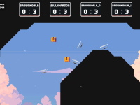
    </td>
  </tr>
</table>

<table>
  <tr>
    <td>
      <h3>Plinko Pals - Ludum Dare 2024</h3>
      
<strong>Date:</strong> October 2024

      
My entry to Ludum Dare 2024 Game Jam, you care for creatures by dropping food through a challenging Plinko board! Strategically place pegs with unique abilities to maximize your score, earn coins, and unlock powerful upgrades.

      
<strong>Languages and Tools:</strong> C#, Unity 6, Asesprite

      <a href="https://domcripps.itch.io/plinko-pals">Play</a>
    </td>
  </tr>
  <tr>
    <td align="left">
      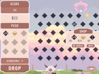
    </td>
  </tr>
</table>

<table>
  <tr>
    <td>
      <h3>Climb Don't Dig - Steam Demo</h3>
      
<strong>Date:</strong> August 2024

      
My first steam demo, you guide a mole from the underground to the surface, relying on an ability to phase through walls and obstacles. As of writing 835 licenses have been claimed.

      
<strong>Languages and Tools:</strong> C#, Unity 2022.3, Asesprite

      <a href="https://store.steampowered.com/app/3272150/Climb_Dont_Dig/">Steam Demo</a>
    </td>
  </tr>
  <tr>
    <td align="left">
      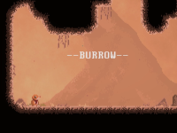
    </td>
  </tr>
</table>

<table>
  <tr>
    <td>
      <h3>Pip - GMTK 2024</h3>
      
<strong>Date:</strong> August 2024

      
Submission for the GMTK Game Jam 2024. Pip is a tile-based puzzle game in which you grow gardens using seeds. It placed 103rd out of 7,595 entries.

      
<strong>Languages and Tools:</strong> C#, Unity 2022.3, Asesprite

      <a href="https://itch.io/jam/gmtk-2024/rate/2906302">Play</a>, <a href="https://youtu.be/i--pTwLQfDw">See Demo</a>
    </td>
  </tr>
  <tr>
    <td align="left">
      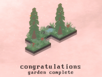
    </td>
  </tr>
</table>

<table>
  <tr>
    <td>
      <h3>Undergraduate Dissertation - A Comparative Analysis of Two-Dimensional Run Length Encoding for Image Compression</h3>
      
<strong>Date:</strong> April 2024

      
This project received a First. This project creates an application that exploits two-dimensional spatial redundancy through the use of a new 2D Run Length Encoding (2D RLE) algorithm in conjunction with existing encoding methods, such as Deflate, Huffman Coding, and the Burrows-Wheeler Transformation. The proposed 2D RLE algorithm when followed with Deflate compression consistently performed better than PNG for low entropy images and similarly to PNG for high entropy images.

      
<strong>Languages and Tools:</strong> C++, Deleaker, OpenCV, ZLib, Python 3

      <a href="Resources/Dissertation.pdf">Report</a>
    </td>
  </tr>
  <tr>
    <td align="left">
      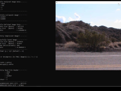
    </td>
  </tr>
</table>

<table>
  <tr>
    <td>
      <h3>3rd Year Games Coursework</h3>
      
<strong>Date:</strong> April 2024

      
This coursework was a 4th year module and received a grade of 87%. You play as a silhouette and every time you close your eyes 'Blink' the world stops existing. You can pass through walls, floors, and all types of obstacles.

      
<strong>Languages and Tools:</strong> C#, Unity 2022.3, Asesprite

      <a href="https://domcripps.itch.io/blink-20">Visit Project</a>, <a href="https://youtu.be/-xyG8-jI4fA">See Demo</a>
    </td>
  </tr>
  <tr>
    <td align="left">
      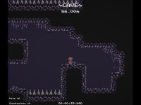
    </td>
  </tr>
</table>

<table>
  <tr>
    <td>
      <h3>3rd Year Mobile Development Coursework - Geo Tracker</h3>
      
<strong>Date:</strong> November 2023

      
An app in which users can record and track their journeys on a map. Users can select their mode of transport, pin places of interest, and add notes to trips.

      
<strong>Languages and Tools:</strong> Android Studio, Open Street Maps API, Java

    </td>
  </tr>
  <tr>
    <td align="left">
      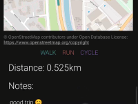
    </td>
  </tr>
</table>

<table>
  <tr>
    <td>
      <h3>2nd Year Group Project - Explainable AI Visualisation</h3>
      
<strong>Date:</strong> May 2023

      
A year-long group project with the aim of representing AI models in an informative and understandable way. It provides intuitive tools for visualising, generating, and interacting with various AI models. Received a grade of 85%.

      
<strong>Languages and Tools:</strong> Python 3, Plotly, SKlearn, Dash

      <a href="Resources/AIVisualisationReport.pdf">Report</a>
    </td>
  </tr>
  <tr>
    <td align="left">
      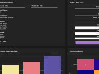
    </td>
  </tr>
</table>

<table>
  <tr>
    <td>
      <h3>2nd Year C++ Coursework</h3>
      
<strong>Date:</strong> March 2023

      
C++ coursework that required we create a game using a basic SDL framework. The project had to meet various functional requirements, ending with a grade of 98%.

      
<strong>Languages and Tools:</strong> C++, SDL, Asesprite

      <a href="https://youtu.be/3Qm3kSCyfI8">See Demo</a>
    </td>
  </tr>
  <tr>
    <td align="left">
      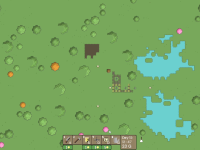
    </td>
  </tr>
</table>

<table>
  <tr>
    <td>
      <h3>2nd Year Developing Maintainable Software Coursework - Snake</h3>
      
<strong>Date:</strong> December 2022

      
Android device programming coursework that required we create a snake game using OpenGL, with focus on keeping the code organised and maintainable through comments, standards, and version control(GitLabs).

      
<strong>Languages and Tools:</strong> IntelliJ IDEA, Java, JUnit, OpenGL, Inkscape

      <a href="https://youtu.be/hnfvjQWcvN4">See Demo</a>
    </td>
  </tr>
  <tr>
    <td align="left">
      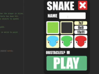
    </td>
  </tr>
</table>

<table>
  <tr>
    <td>
      <h3>Drift King 3D - Mobile Game</h3>
      
<strong>Date:</strong> November 2022

      
A mobile endless runner where you play as a car and can only control steering by either drifting left or drifting right. Published on the Google Play store with 1200+ installations. First look at Unity optimisations e.g. object pooling, Unity Profiler.

      
<strong>Languages and Tools:</strong> C#, Unity 2022, Blender, Asesprite

      <a href="https://domcripps.itch.io/drift-king-3d">Play</a>, <a href="https://youtu.be/QZCCU-xeAI4">See Demo</a>
    </td>
  </tr>
  <tr>
    <td align="left">
      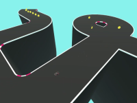
    </td>
  </tr>
</table>

<table>
  <tr>
    <td>
      <h3>Sandpit - Mini Jam 108</h3>
      
<strong>Date:</strong> June 2022

      
A submission to the Mini Jam 108 with the theme "Seaside". You are given a series of sand castles which you need to recreate by using tools to place and destroy sand.

      
<strong>Languages and Tools:</strong> C#, Unity 2022, (Quad rendering / voxels)

      <a href="https://domcripps.itch.io/sandpit">Play</a>
    </td>
  </tr>
  <tr>
    <td align="left">
      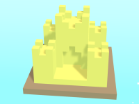
    </td>
  </tr>
</table>

<table>
  <tr>
    <td>
      <h3>Blink - Brackeys 2022.1</h3>
      
<strong>Date:</strong> February 2022

      
Won the 2022.1 Brackeys Game Development Competition, placing 1st in the Innovation Category and 6th overall out of 1,600 entries.

      
<strong>Languages and Tools:</strong> Unreal Engine 4, UE Blueprints, C++, Piskel

      <a href="https://itch.io/jam/brackeys-7/rate/1412513">Play</a>, <a href="https://youtu.be/xtjeWKtBd3Y">See Demo</a>
    </td>
  </tr>
  <tr>
    <td align="left">
      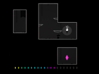
    </td>
  </tr>
</table>

<table>
  <tr>
    <td>
      <h3>Split - Puzzle Game</h3>
      
<strong>Date:</strong> January 2022

      
A puzzle game in which the goal is to cover all blue tiles with a ball. You do this by moving, splitting, and using the shape of the board to avoid obstacles.

      
<strong>Languages and Tools:</strong> Unreal Engine 4, UE Blueprints, C++, Inkscape

      <a href="https://domcripps.itch.io/split">Play</a>
    </td>
  </tr>
  <tr>
    <td align="left">
      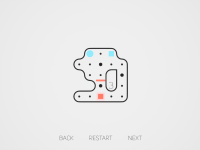
    </td>
  </tr>
</table>

<table>
  <tr>
    <td>
      <h3>Cannon Chaos - Brackeys 2021.2</h3>
      
<strong>Date:</strong> August 2021

      
A submission to the Brackeys 2021.2 Game Jam with the theme "Let There Be Chaos". It is a 3D puzzle game in which you need to place items in the correct locations in order to successfully sink ships.

      
<strong>Languages and Tools:</strong> Unreal Engine 4, UE Blueprints, Blender

      <a href="https://domcripps.itch.io/cannon-chaos">Play</a>, <a href="https://youtu.be/r72qOOkpT3Y">See Demo</a>
    </td>
  </tr>
  <tr>
    <td align="left">
      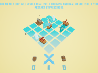
    </td>
  </tr>
</table>

<table>
  <tr>
    <td>
      <h3>Life of Slime - GMTK 2021</h3>
      
<strong>Date:</strong> June 2021

      
A submission to the GMTK Game Jam 2021 with the theme "Joined Together". It is a 2D platformer where you play as a slime. When you are attacked by other slimes you grow larger, which in turn makes the game more difficult.

      
<strong>Languages and Tools:</strong> Unreal Engine 4, UE Blueprints, Piskel

      <a href="https://domcripps.itch.io/life-of-slime">Play</a>
    </td>
  </tr>
  <tr>
    <td align="left">
      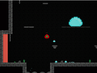
    </td>
  </tr>
</table>

<table>
  <tr>
    <td>
      <h3>A Level Computer Science Coursework</h3>
      
<strong>Date:</strong> January 2021

      
Coursework created for my A-Level Computer Science class. It was created in Unreal Engine and was my first ever pure C++ project in Unreal.

      
<strong>Languages and Tools:</strong> Unreal Engine 4, C++, Blender

      <a href="https://studio.youtube.com/video/r1G5bGsGGh0/edit">Watch Demo</a>
    </td>
  </tr>
  <tr>
    <td align="left">
      
    </td>
  </tr>
</table>

<table>
  <tr>
    <td>
      <h3>Lost Light - Brackeys 2020.2</h3>
      
<strong>Date:</strong> August 2020

      
Created for the Brackeys 2020.2 Game Jam with the theme "Rewind". The player has the ability to rewind the motion of dynamic obstacles. The game was my first submission to a game jam and features a custom-level editor.

      
<strong>Languages and Tools:</strong> Unreal Engine 4, UE Blueprints, C++

      <a href="https://domcripps.itch.io/lost-light">Play</a>, <a href="https://youtu.be/bdKRP0EHu8E">See Demo</a>
    </td>
  </tr>
  <tr>
    <td align="left">
      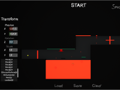
    </td>
  </tr>
</table>

<table>
  <tr>
    <td>
      <h3>Virtual Labs - A Level EPQ Artifact</h3>
      
<strong>Date:</strong> May 2020

      
Created as part of my EPQ for which I received an A. The project demonstrates how virtual environments can be a valuable tool in STEM education by simulating a required GCSE physics experiment.

      
<strong>Languages and Tools:</strong> Unreal Engine 4, UE Blueprints, C++

      <a href="https://youtu.be/Xal6emxV-sA">See Demo</a>
    </td>
  </tr>
  <tr>
    <td align="left">
      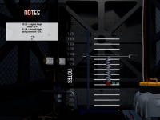
    </td>
  </tr>
</table>

