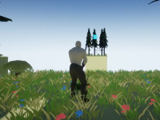

# Dominic Cripps

Welcome to my portfolio! I am a Computer Science graduate and independent game developer with a passion for creating engaging, innovative projects. Below, you’ll find details about my qualifications and notable projects.

---

<h2>About Me</h2>

I am a recent graduate in Computer Science from the University of Nottingham with experience in game development, software engineering, and explainable AI. I enjoy creating projects that blend technical problem-solving with creativity, including games, software tools, and research-driven applications.

---

<h2>Qualifications</h2>

  
- **Education:**
  - **BSc (Hons) Computer Science**  
    University of Nottingham | First-Class Honours  
    Dissertation: A Comparative Analysis of Two-Dimensional Run Length Encoding for Image Compression (Grade: First)
  - **A-Levels:** Mathematics (A*), Further Mathematics (A*), Computer Science (A*), Physics (A), EPQ (A)
  
- **Skills:**
  - Programming: C++, C#, Python, Java, JavaScript, HTML/CSS
  - Areas of Expertise: Game Development, Image Processing, Explainable AI

- **Achievements:**
  - Finalist in Crazy Web Game 2024 (Top 10 out of 317 games, sponsored by Unity)
  - Winner of the 2022.1 Brackeys Game Development Competition (1st in Innovation Category)
  - Undergraduate High Achievers recognition at the University of Nottingham

---

## Projects

<table>
  <tr>
    <td>
      
    </td>
    <td style="padding-left: 16px; vertical-align: top;">
      <h3>Hyper Drone Racing - Crazy Web Game Jam 2024 Finalist</h3>
      
<strong>Date:</strong> November 2024

      
This is a brief description of the project. It provides an overview of the project's purpose and key features.

      <a href="">Visit Project</a>
    </td>
  </tr>
</table>

<table>
  <tr>
    <td>
      
    </td>
    <td style="padding-left: 16px; vertical-align: top;">
      <h3>Plinko Pals - Ludum Dare 2024</h3>
      
<strong>Date:</strong> October 2024

      
This is a brief description of the project. It provides an overview of the project's purpose and key features.

      <a href="">Visit Project</a>
    </td>
  </tr>
</table>

<table>
  <tr>
    <td>
      
    </td>
    <td style="padding-left: 16px; vertical-align: top;">
      <h3>Climb Don't Dig - Steam Demo</h3>
      
<strong>Date:</strong> August 2024

      
This is a brief description of the project. It provides an overview of the project's purpose and key features.

      <a href="">Visit Project</a>
    </td>
  </tr>
</table>

<table>
  <tr>
    <td>
      
    </td>
    <td style="padding-left: 16px; vertical-align: top;">
      <h3>Pip - GMTK 2024</h3>
      
<strong>Date:</strong> August 2024

      
This is a brief description of the project. It provides an overview of the project's purpose and key features.

      <a href="">Visit Project</a>
    </td>
  </tr>
</table>

<table>
  <tr>
    <td>
      
    </td>
    <td style="padding-left: 16px; vertical-align: top;">
      <h3>Undergraduate Dissertation</h3>
      
<strong>Date:</strong> April 2024

      
This is a brief description of the project. It provides an overview of the project's purpose and key features.

      <a href="">Visit Project</a>
    </td>
  </tr>
</table>

<table>
  <tr>
    <td>
      
    </td>
    <td style="padding-left: 16px; vertical-align: top;">
      <h3>3rd Year Games Coursework</h3>
      
<strong>Date:</strong> April 2024

      
This is a brief description of the project. It provides an overview of the project's purpose and key features.

      <a href="">Visit Project</a>
    </td>
  </tr>
</table>

<table>
  <tr>
    <td>
      
    </td>
    <td style="padding-left: 16px; vertical-align: top;">
      <h3>3rd Year Mobile Development Coursework - Geo Tracker</h3>
      
<strong>Date:</strong> November 2023

      
This is a brief description of the project. It provides an overview of the project's purpose and key features.

      <a href="">Visit Project</a>
    </td>
  </tr>
</table>

<table>
  <tr>
    <td>
      
    </td>
    <td style="padding-left: 16px; vertical-align: top;">
      <h3>2nd Year Group Project - Explainable AI Visualisation</h3>
      
<strong>Date:</strong> May 2023

      
This is a brief description of the project. It provides an overview of the project's purpose and key features.

      <a href="">Visit Project</a>
    </td>
  </tr>
</table>

<table>
  <tr>
    <td>
      
    </td>
    <td style="padding-left: 16px; vertical-align: top;">
      <h3>2nd Year C++ Coursework</h3>
      
<strong>Date:</strong> March 2023

      
This is a brief description of the project. It provides an overview of the project's purpose and key features.

      <a href="">Visit Project</a>
    </td>
  </tr>
</table>

<table>
  <tr>
    <td>
      
    </td>
    <td style="padding-left: 16px; vertical-align: top;">
      <h3>2nd Year Android Device Programming Coursework - Snake</h3>
      
<strong>Date:</strong> December 2022

      
This is a brief description of the project. It provides an overview of the project's purpose and key features.

      <a href="">Visit Project</a>
    </td>
  </tr>
</table>

<table>
  <tr>
    <td>
      
    </td>
    <td style="padding-left: 16px; vertical-align: top;">
      <h3>Drift King 3D - Mobile Game</h3>
      
<strong>Date:</strong> November 2022

      
This is a brief description of the project. It provides an overview of the project's purpose and key features.

      <a href="">Visit Project</a>
    </td>
  </tr>
</table>

<table>
  <tr>
    <td>
      
    </td>
    <td style="padding-left: 16px; vertical-align: top;">
      <h3>Sandpit - Mini Jam 108 </h3>
      
<strong>Date:</strong> June 2022

      
This is a brief description of the project. It provides an overview of the project's purpose and key features.

      <a href="">Visit Project</a>
    </td>
  </tr>
</table>

<table>
  <tr>
    <td>
      
    </td>
    <td style="padding-left: 16px; vertical-align: top;">
      <h3>Blink - Brackeys 2022.1</h3>
      
<strong>Date:</strong> February 2022

      
This is a brief description of the project. It provides an overview of the project's purpose and key features.

      <a href="">Visit Project</a>
    </td>
  </tr>
</table>

<table>
  <tr>
    <td>
      
    </td>
    <td style="padding-left: 16px; vertical-align: top;">
      <h3>Split - Puzzle Game</h3>
      
<strong>Date:</strong> January 2022

      
This is a brief description of the project. It provides an overview of the project's purpose and key features.

      <a href="">Visit Project</a>
    </td>
  </tr>
</table>

<table>
  <tr>
    <td>
      
    </td>
    <td style="padding-left: 16px; vertical-align: top;">
      <h3>Cannon Chaos - Brackeys 2021.2</h3>
      
<strong>Date:</strong> August 2021

      
This is a brief description of the project. It provides an overview of the project's purpose and key features.

      <a href="">Visit Project</a>
    </td>
  </tr>
</table>

<table>
  <tr>
    <td>
      
    </td>
    <td style="padding-left: 16px; vertical-align: top;">
      <h3>Life of Slime - GMTK 2021</h3>
      
<strong>Date:</strong> June 2021

      
This is a brief description of the project. It provides an overview of the project's purpose and key features.

      <a href="">Visit Project</a>
    </td>
  </tr>
</table>

<table>
  <tr>
    <td>
      
    </td>
    <td style="padding-left: 16px; vertical-align: top;">
      <h3>A Level Computer Science Coursework</h3>
      
<strong>Date:</strong> January 2021

      
This is a brief description of the project. It provides an overview of the project's purpose and key features.

      <a href="">Visit Project</a>
    </td>
  </tr>
</table>

<table>
  <tr>
    <td>
      
    </td>
    <td style="padding-left: 16px; vertical-align: top;">
      <h3>Lost Light - Brackeys 2020.2</h3>
      
<strong>Date:</strong> August 2020

      
This is a brief description of the project. It provides an overview of the project's purpose and key features.

      <a href="">Visit Project</a>
    </td>
  </tr>
</table>

<table>
  <tr>
    <td>
      
    </td>
    <td style="padding-left: 16px; vertical-align: top;">
      <h3>Virtual Labs - A Level EPQ Artifact</h3>
      
<strong>Date:</strong> May 2020

      
This is a brief description of the project. It provides an overview of the project's purpose and key features.

      <a href="">Visit Project</a>
    </td>
  </tr>
</table>

